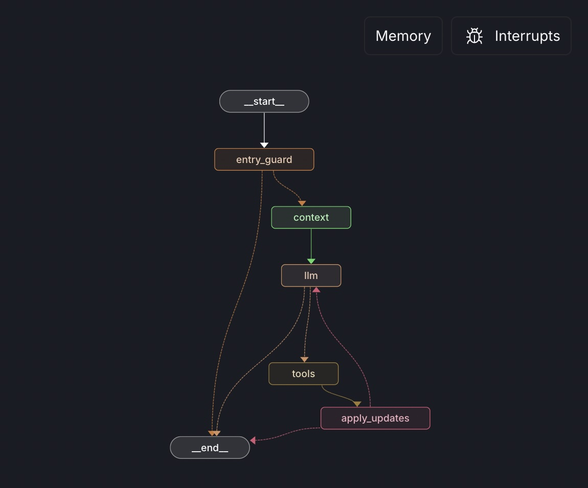

# Polymarket AI Agent

> AI-powered autonomous trading agent for Polymarket prediction markets, built with LangGraph

An intelligent trading bot that analyzes news sentiment and market data to make informed bets on prediction markets. Features human-in-the-loop trade approvals and real-time market monitoring.



## 🚀 Quick Start

```bash
# Clone and install
git clone https://github.com/sentic-ai/polymarket-trader.git
cd polymarket_agent
pip install -e .

# Configure API keys
cp .env.example .env
# Add your OpenAI, Tavily, and Polymarket keys

# Run the agent
langgraph dev
```

## ⚡ Features

- **🧠 LLM-Powered Analysis**: GPT-5-mini analyzes market data + news sentiment
- **📊 Real-time Market Data**: Live integration with Polymarket Gamma API
- **📰 News Intelligence**: Tavily API for relevant news + impact analysis
- **🛡️ Human Approval**: Trade execution requires user confirmation

## 🏗️ Architecture

The agent uses a LangGraph state machine with these nodes:

1. **Entry Guard** - Rate limiting and market change detection
2. **Context Builder** - Builds system prompt with current state
3. **Trader Brain** - LLM with tools (market data, news, trade)
4. **Tool Execution** - Executes API calls and tool functions
5. **State Updates** - Updates balances and trade history

## 🔧 Configuration

Key environment variables:

```bash
POLY_AGENT_MODEL=gpt-5-mini           # LLM model
POLY_AGENT_MAX_STEPS=6                # Max tool calls per run
POLYMARKET_MARKET_ID=516713           # Target market
OPENAI_API_KEY=sk-...                 # Required
TAVILY_API_KEY=tvly-...               # For news
```

## 📱 Frontend Dashboard

The React frontend provides:

- Real-time trade monitoring
- Agent decision explanations
- Portfolio performance tracking
- Manual trade approval interface

```bash
cd frontend
npm install && npm run dev
```
